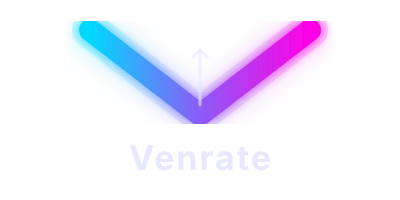
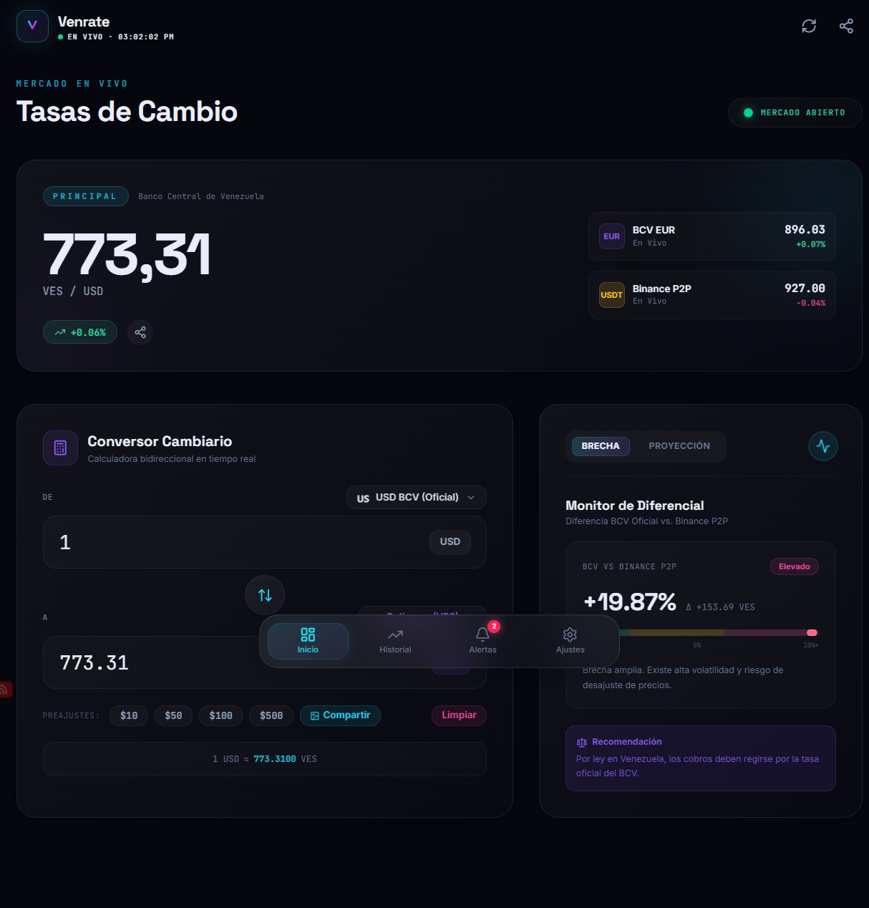
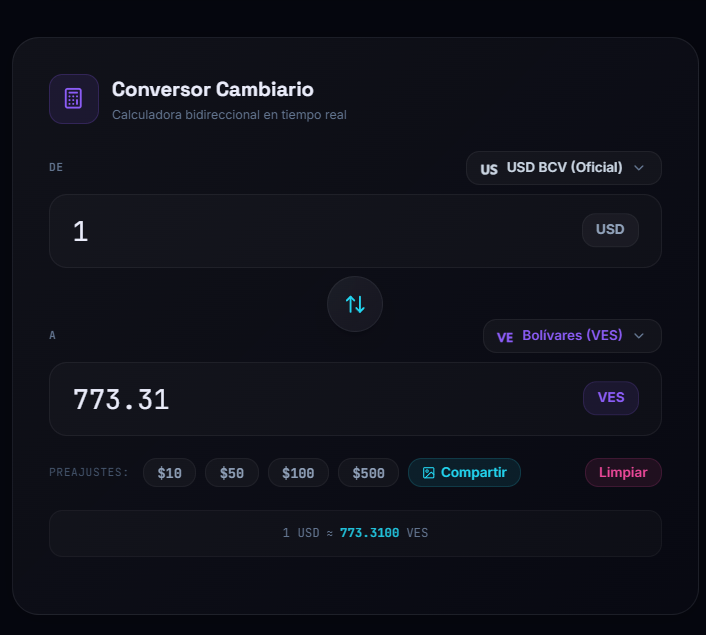
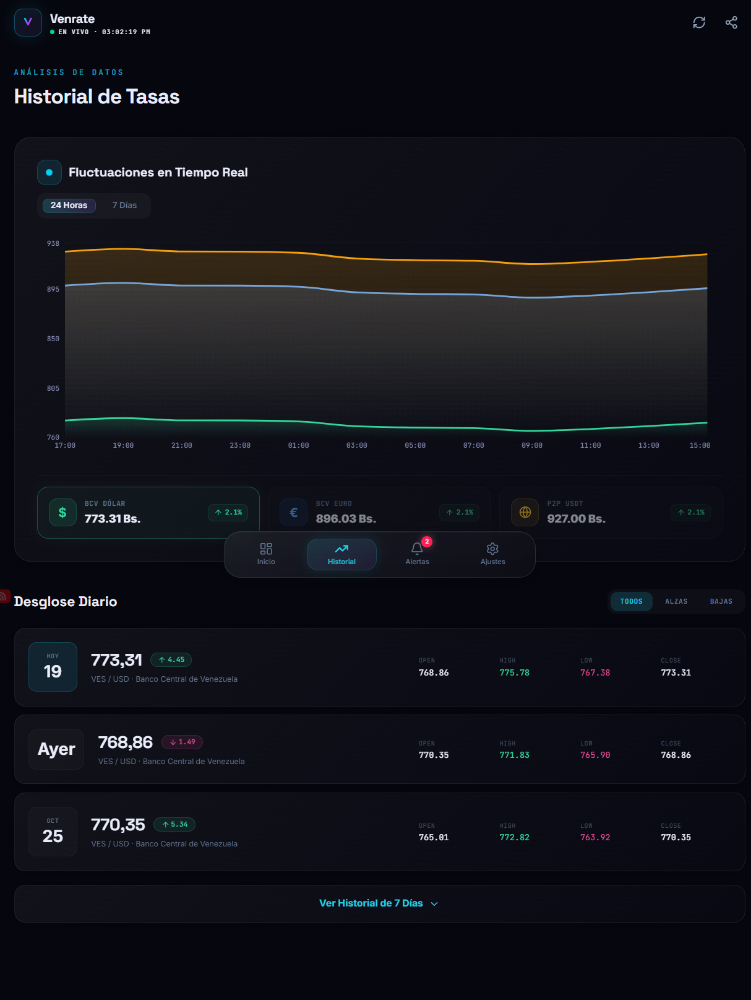
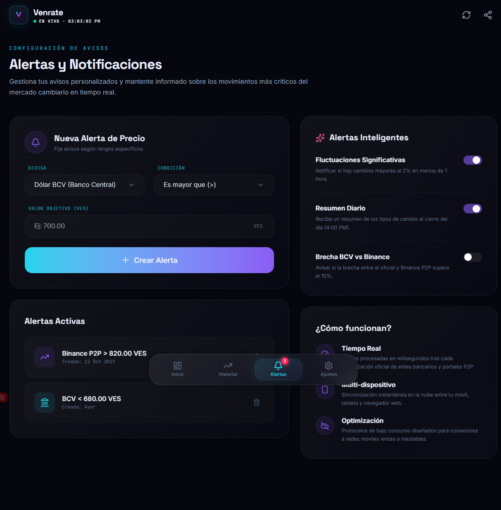
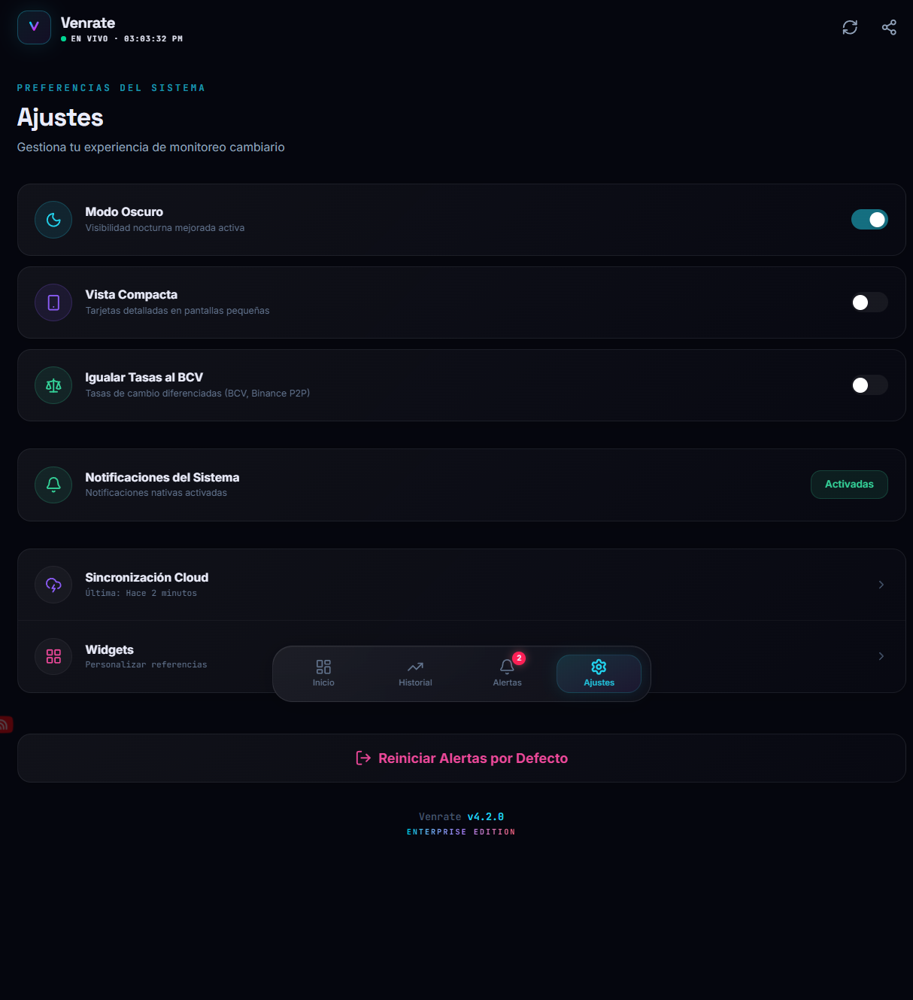

<div align="center">



# Venrate

### Monitor de Divisas Venezolano — BCV, Euro & Binance P2P en tiempo real

<a href="https://venrate-production.up.railway.app"></a>


**🌐 Live app:** [venrate-production.up.railway.app](https://venrate-production.up.railway.app)

---

</div>

## 🚀 ¿Qué es Venrate?

**Venrate** es un monitor de tasas de cambio venezolano que rastrea en **tiempo real** el precio del bolívar frente a las principales divisas. Consulta datos en vivo de **BCV (USD/EUR)** y **Binance P2P (USDT)**, y te ofrece una calculadora interactiva, alertas configurables con notificaciones nativas, gráficos históricos y análisis del spread entre el mercado oficial y el paralelo.

Diseñado como una **PWA instalable** con soporte offline — instálalo en tu teléfono y mantente informado incluso sin conexión.

## ✨ Funcionalidades

- **📈 Tasas en vivo** — BCV (USD), BCV (EUR) y Binance P2P (USDT) con actualización automática
- **🧮 Calculadora** — Convierte entre VES y cualquier divisa monitoreada
- **📊 Análisis de spread** — Medidor visual del diferencial entre mercado oficial y paralelo
- **🔔 Alertas de precio** — Disparadores "mayor que / menor que / igual a" con notificaciones nativas del navegador y vibración
- **🤖 Alertas inteligentes** — Fluctuaciones, resúmenes diarios y avisos de brecha BCV-paralelo (opt-in)
- **📉 Gráficos históricos** — Gráfica de área interactiva (Recharts) con vistas de 7 y 30 días
- **📱 PWA** — Instalable en móvil y escritorio, offline-first con caché de service worker
- **🌗 Modo oscuro / claro** — Sistema de diseño "Aurora Night" con tokens de color semánticos
- **👁 Vista compacta** — Alterna un layout minimalista para pantallas pequeñas
- **⚖️ Ecualización BCV** — Establece temporalmente todas las tasas al valor BCV para escenarios de precios uniformes
- **💾 Estado persistente** — Alertas y preferencias guardadas en localStorage

## 📸 Capturas de pantalla

| Dashboard | Calculadora | Historial |
|:---------:|:-----------:|:---------:|
|  |  |  |

| Alertas | Ajustes | |
|:-------:|:--------:|:--------:|
|  |  | |

## 🛠 Tech Stack

| Capa | Tecnología |
|------|------------|
| **Frontend** | React 19 · TypeScript · Tailwind CSS 4 · Vite |
| **Backend** | Express (serving estático + endpoint `/api/rates`) |
| **Animación** | [Motion](https://motion.dev) (antes Framer Motion) |
| **Gráficos** | [Recharts](https://recharts.org) |
| **Dropdowns** | [Headless UI](https://headlessui.com) (Listbox) |
| **Compartir imagen** | [html-to-image](https://github.com/bubkoo/html-to-image) |
| **Iconos** | [Lucide React](https://lucide.dev) |
| **PWA** | [vite-plugin-pwa](https://vite-pwa-org.netlify.app) + Workbox |
| **Seguridad** | Helmet + express-rate-limit (30 req/min) |
| **Deploy** | [Railway](https://railway.app) |

### 🎨 Sistema de diseño — "Aurora Night"

- Paneles de glassmorphism (`glass`, `glass-strong`, `glass-card`)
- Tokens de color semánticos (`text-on-surface`, `text-primary`, `text-secondary`, etc.)
- **Oscuro por defecto**, con soporte completo de modo claro vía clase `html.light`
- Soporte de movimiento reducido (`prefers-reduced-motion: reduce`)
- **Tipografías:** Space Grotesk (títulos), JetBrains Mono (datos), Inter (cuerpo)
- Fondo aurora animado con deriva de keyframes CSS

## 🚀 Empezando

### Prerrequisitos

- [Node.js](https://nodejs.org) 18+
- npm (incluido con Node)

### Instalación

```bash
# Clonar el repositorio
git clone https://github.com/reimen-r/Venrate.git
cd Venrate

# Instalar dependencias
npm install
```

### Desarrollo

```bash
npm run dev
```

Abre en `http://localhost:3000`. El servidor Express proxya Vite para HMR durante el desarrollo.

### Build de producción

```bash
npm run build
npm run start
```

Compila la SPA con Vite, empaqueta el servidor Express con esbuild y sirve todo desde `dist/`.

### Linting

```bash
npm run lint
```

Ejecuta el chequeo de tipos de TypeScript (`tsc --noEmit`).

## 🔧 Variables de Entorno

| Variable | Requerida | Descripción |
|----------|-----------|-------------|
| `GEMINI_API_KEY` | No | API key de Google Gemini (solo para funciones con IA) |
| `PORT` | No | Puerto del servidor (por defecto `3000`) |

## 🌐 Fuentes de Datos

El endpoint `/api/rates` usa una cadena de respaldo de múltiples capas:

1. **Primaria:** `open.er-api.com` para tasas oficiales de BCV USD/EUR (fuente confiable)
2. **Complementaria:** `monitordedivisavenezuela.com` (scraping) y `usdt.com.ve` para datos del mercado venezolano
3. **Validación de plausibilidad:** los valores fuera del rango 500–1500 VES se rechazan para evitar datos corruptos del scraping
4. **Caché:** caché en memoria de 5 minutos con [Stale-While-Revalidate](https://web.dev/stale-while-revalidate/) — las cachés expiradas se sirven al instante mientras una petición en segundo plano las refresca

## 📦 Estructura del Proyecto

```
Venrate/
├── server.ts              # Servidor Express (API + serving estático)
├── src/
│   ├── main.tsx           # Punto de entrada de React + error boundary
│   ├── App.tsx            # Centro de estado + routing lazy por tabs
│   ├── constants.ts       # Intervalos, umbrales, tasas de respaldo
│   ├── types.ts           # Interfaces TypeScript
│   ├── index.css          # Tailwind + tokens de diseño Aurora Night
│   ├── lib/
│   │   └── notifications.ts  # API de Notificación nativa + Vibración
│   └── components/
│       ├── DashboardTab.tsx          # Tasas en vivo, calculadora, spread
│       ├── CurrencySelect.tsx        # Dropdown de divisas (Headless UI)
│       ├── ShareableConversionCard.tsx # Tarjeta de conversión para compartir
│       ├── HistoryTab.tsx            # Gráficos históricos (Recharts)
│       ├── AlertsTab.tsx             # Alertas de precio + toggles inteligentes
│       ├── SettingsTab.tsx           # Modo oscuro, vista compacta, widgets
│       ├── TopAppBar.tsx             # Header con elevación al hacer scroll
│       ├── BottomNavBar.tsx          # Navegación flotante
│       ├── Background.tsx            # Animación de orbes aurora
│       ├── AnimatedNumber.tsx        # Componente de conteo con spring
│       ├── SkeletonCard.tsx          # Placeholder de carga
│       └── ErrorBoundary.tsx         # Wrapper de error boundary
└── public/
    ├── favicon.svg
    ├── logo.svg
    ├── og-image.svg
    ├── manifest.json
    └── icon-{192,512}.png
```

## 🚂 Deployment (Railway)

La app se auto-despliega en Railway en cada push a `main`.

```bash
# Deploy manual vía CLI
railway up --detach --service venrate
```

**Importante:** Existen dos servicios — `venrate` y `Venrate`. El activo para deploys por CLI es `venrate`.

### Workflow de Deployment

1. `npm run lint` antes de hacer commit
2. `git add . && git commit -m "mensaje"`
3. `git push origin main` → Railway auto-despliega
4. Verificar: `railway status`
5. Si el auto-deploy falla: `railway up --detach --service venrate`

---

<div align="center">
  <sub>Hecho con <code>motion/react</code>, animaciones spring & mucho café ☕</sub>
</div>
